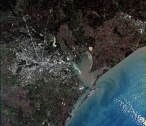

# Хьюстон
**Хьюстон** (англ. Houston) — четвёртый по количеству жителей город в Соединённых Штатах Америки и крупнейший город в штате Техас с населением 2 319 603 человека на 2017 год. Хьюстон является административным центром округа Харрис, а также главным экономическим центром агломерации Большого Хьюстона с общим населением 6 772 470 человек на 2016 год. Город располагается в 50 километрах от Мексиканского залива на прибрежной равнине.

Хьюстон был основан 30 августа 1836 года и включён в состав республики Техас 5 июня 1837 года, получив своё имя в честь Сэмюэла Хьюстона — главнокомандующего армией Техаса во время Техасской революции и президента Республики Техас. Быстрое развитие порта и железных дорог в XIX веке, а также начало добычи нефти и последовавшее развитие нефтяной промышленности в XX веке привели к быстрому росту населения. В 1960-е годы количество жителей превысило один миллион человек, а в 2000-е — два миллиона.

Город является ведущим мировым центром энергетической промышленности, а экономика города также представлена предприятиями в области аэронавтики, транспорта и здравоохранения. Важнейшими объектами для экономики и инфраструктуры города являются космический центр имени Линдона Джонсона, крупнейший американский по международным грузоперевозкам порт, хьюстонский судоходный канал, крупнейший в мире Техасский медицинский центр.

## Содержание
1. [История](#история)
    1. [Этимология, прозвища](#этимология)
    1. [Основание](#основание)
    1. [XX век](#хх)
1. [Физико-географическая характеристика](#характеристика)
    1. [Географическое положение и климат](#климат)
    1. [Рельеф, внутренние воды](#рельеф)
    1. [Флора и фауна](#фауна)
1. [Экономика](#экономика)
    1. [Общее состояние](#состояние)
    1. [Энергетика и нефтехимия](#нефтехимия)
    1. [Авиакосмическая промышленность](#промышленность)
1. [Население](#население)
    1. [Динамика и структура населения](#структура)
    1. [Этнический и конфессиональный состав, языки](#языки)
1. [Средства массовой информации](#средства)
1. [Города-побратимы](#города)    

##  История
###  Этимология, прозвища

Сэмюэл Хьюстон

Город назван в честь Сэмюэла Хьюстона — главнокомандующего армией Техаса во время Техасской революции (1835—1836) и президента Республики Техас (1836—1838, 1841—1844).

Официальное прозвище Хьюстона — «Space city», которое можно перевести, как «космический город», «город космонавтики» или «космоград». Название дано из-за того, что здесь находится космический центр имени Линдона Джонсона. Всего город имеет 12 прозвищ.

В американской разговорной речи есть популярная фраза: **«Хьюстон, у нас проблема»** (англ. Houston, we’ve had a problem), появившаяся после неудачной миссии Аполлон-13. В Хьюстоне проходили съёмки фильма «Аполлон-13», в основу сюжета которого легли реальные события миссии.

###  Основание

Allen’s Landing — место, где был основан город

После окончания войны за независимость Техаса, в августе 1836 года предприниматели братья Август и Джон Аллены купили 26,9 км2 земли вдоль реки Буффало-Байю, планируя основать на ней населённый пункт. Они хотели, чтобы будущий город стал столицей Техаса и крупным торговым центром.

Датой основания города принято считать 30 августа 1836 года, когда братья Аллены разместили объявление о появлении города. Город назвали в честь генерала Сэма Хьюстона, возглавлявшего
армию техасцев в битве при Сан-Хасинто во время войны против Мексики, позже избранного президентом Техаса. На январь 1837 года в посёлке проживало всего 12 человек, однако через четыре
месяца население возросло до 1 500 человек. 5 июня 1837 года город был включён в округ Гаррисберг (ныне Харрис) и стал временной столицей Республики Техас, которой оставался до 1839 года. 
Первым мэром Хьюстона стал Джеймс Холман.

###  XX век

Мэйн-Стрит в центре, 1908 год

В 1900 году на Хьюстон обрушился Галвестонский ураган, продолжавшийся с 27 августа по 12 сентября. В пересчете на сегодняшний курс ущерб составил бы $526 млн, погибло 8 тысяч человек. В следующем году было найдено большое месторождение нефти вблизи города Бомонт, что послужило началом развития нефтяной промышленности в Техасе. В 1902 году президент США Теодор Рузвельт утвердил проект стоимостью в $1 млн на реконструкцию хьюстонского судоходного канала. К 1910
году численность населения города достигла 78 800 человек, почти в два раза превысив количество жителей проживавших в Хьюстоне в 1900 году. В 1914 году президент США Вудро Вильсон принял
участие в открытии нового глубоководного порта Хьюстона, а через год был открыт хьюстонский судоходный канал. 

В 1945 году было начато формирование Техасского медицинского центра. В конце 1940-х несколько пригородов были включены в городскую черту, в результате чего площадь Хьюстона увеличилась
более чем в два раза. В 1950-е годы управления многих крупных (в основном нефтяных) компаний США переместились в Хьюстон, что благоприятно отразилось на экономике города, одним из
поводов для переезда послужило массовое оснащение всех офисов кондиционерами.

>Именно кондиционирование воздуха! Именно оно было основой для стремительного
роста Хьюстона в 1950 году, когда он стал наиболее оснащённым кондиционерами городом в мире. Именно это стимулировало многие корпорации переместить свои штаб-квартиры в Хьюстон.

В 1962—1964 годах в двадцати пяти милях к югу от центра Хьюстона, на землях, переданных федеральному правительству университетом Райса, был построен Центр управления космическими кораблями, с 1973 года носящий имя Линдона Джонсона. В 1960-х годах население Хьюстона достигло миллиона человек.
##  Физико-географическая характеристика
###  Географическое положение и климат

###  Рельеф, внутренние воды

###  Флора и фауна

##  Экономика
###  Общее состояние

###  Энергетика и нефтехимия

###  Авиакосмическая промышленность

##  Население
###  Динамика и структура населения

###  Этнический и конфессиональный состав, языки

##  Средства массовой информации

##  Города-побратимы

